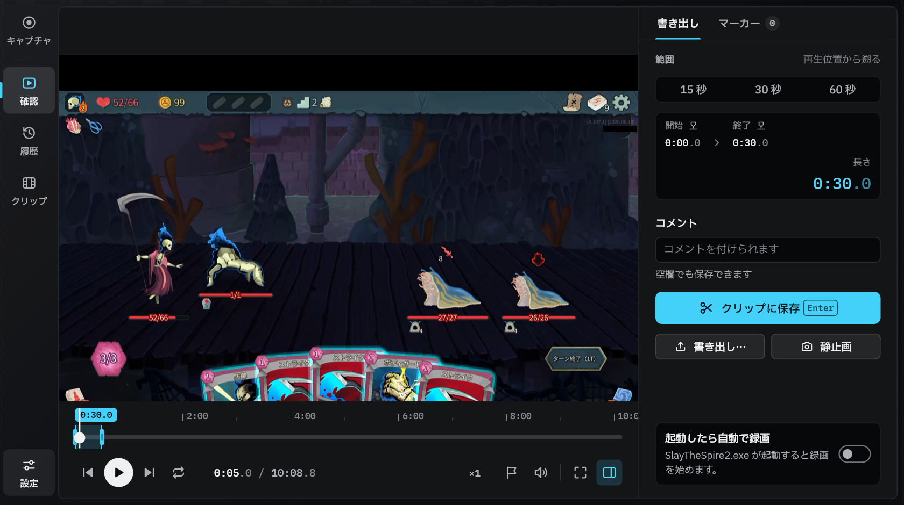
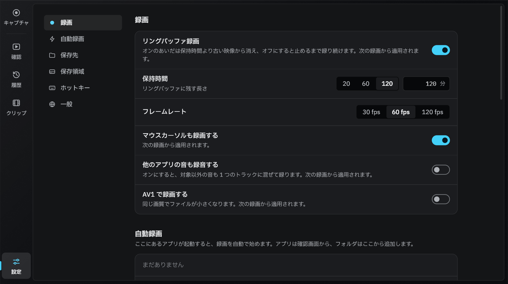

# Liveback

**録りながら見返せて、残したい場面だけをすぐ書き出せる録画アプリ**

## 💡 コンセプト

### ⏪ 録画中でも見返せる

録画を止めずにタイムラインを巻き戻して、さっきの場面をその場で確認できます。気になった瞬間はホットキー（<kbd>Ctrl</kbd>+<kbd>Shift</kbd>+<kbd>R</kbd>）でマーカーを付けておけます。

### 🎮 一度設定すれば、あとは自動で録画

ゲームやアプリを登録しておくと、起動したタイミングで録画が始まります。Windows ログイン時の起動とトレイ常駐を組み合わせれば、録り忘れがありません。

### 🪶 軽量動作

GPU のハードウェアエンコーダで録画し、ゲームや作業への負荷がほとんどかからないように設計しています。

### ✂️ 気に入った範囲をすぐ書き出す

見返して範囲を選べば、その部分だけを MP4 として書き出せます。

## ✨ 主な機能

- **録画対象**：アプリを選んで録画（画面全体も可）。通知や他のアプリは映り込みません
- **録画の残し方**：直近の一定時間だけを残すリングバッファ録画と、止めるまで録り続ける無制限録画を切り替え
- **音声**：対象アプリの音だけを録音（全アプリの音にも切り替え可）
- **フレームレート**：30 / 60 / 120 fps
- 履歴の検索・コメント・保護、日本語 / English UI

## 💻 動作環境

- Windows 11 22H2 以降（x64）
- ハードウェア H.264 エンコーダを持つ GPU（NVIDIA / AMD / Intel）
- 録画先ドライブに 10 GiB 以上の空き

## 📦 インストール

[Releases](https://github.com/koorinonaka/liveback/releases/latest) から `Liveback_<version>_x64-setup.exe` をダウンロードして実行してください。管理者権限は要りません。

## 🚀 使い方

1. **キャプチャ** で録画したいアプリを選ぶと、録画が始まります
2. **確認** でタイムラインをシークし、マーカーやプレビューで見返したい場面を探します
3. （必要なときだけ）残したい範囲を選んで **書き出し** します

> [!TIP]
> ウィンドウを閉じてもトレイに常駐して録画を続けます。停止と終了はトレイメニューから行えます。

## ⚙️ 設定

| 設定 | 内容 |
| --- | --- |
| リングバッファ録画 | オンにすると直近の一定時間（5〜1440 分）だけを残し、それより古い映像は自動で削除します。ディスク容量を一定に抑えたいときに便利です。オフにすると止めるまで無制限に録り続けます |
| フレームレート | 30 / 60 / 120 fps |
| 他のアプリの音も録音 | 対象アプリの音だけ（既定）⇄ 全アプリの音 |
| 容量 / 期間で自動削除 | 古いセッションを容量（GB）や日数で自動削除。保護したセッションは残ります |
| 録画バッファフォルダ | 録画データの保存先を変更 |
| ホットキー | マーカー追加のグローバルホットキー |

## 🛠️ 開発

ビルド方法・テスト・インストーラー作成・内部構造は [docs/development.md](docs/development.md) を参照してください。

## 📄 ライセンス

[MIT License](LICENSE)

| 主な依存 | ライセンス |
| --- | --- |
| [Slint](https://slint.dev/)（UI、`i-slint-*` 含む） | Slint Royalty-free 2.0  |
| [wgpu / wgpu-hal](https://wgpu.rs/)（`vendor/wgpu-hal` にパッチ版を同梱） | MIT OR Apache-2.0 |
| [skia-safe](https://github.com/rust-skia/rust-skia)（描画） | MIT |
| [windows / windows-core](https://github.com/microsoft/windows-rs)（Win32 バインディング） | MIT OR Apache-2.0 |
| [signalsmith-stretch](https://github.com/Signalsmith-Audio/signalsmith-stretch)（音声の時間伸縮） | MIT |

そのほかの依存はすべて MIT / Apache-2.0 / Zlib です。
